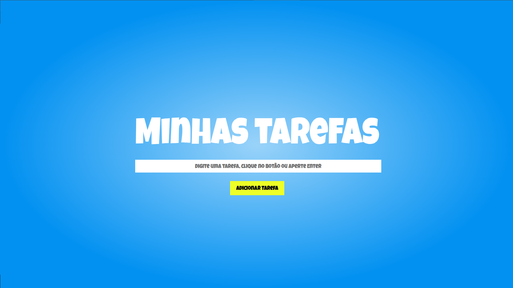

# Projeto de Lista de Tarefas

Um simples aplicativo de lista de tarefas criado com React. Permite adicionar, finalizar e remover tarefas.

## 📋 Visão Geral

O projeto consiste em um aplicativo de lista de tarefas desenvolvido em React. Ele permite que os usuários adicionem novas tarefas, marquem tarefas como concluídas e removam tarefas da lista. O objetivo é fornecer uma interface simples e intuitiva para gerenciar e acompanhar as tarefas diárias.

## 🛠️ Tecnologias Utilizadas

- React
- HTML
- CSS

O projeto foi desenvolvido usando a biblioteca React para a criação dos componentes e manipulação do estado. As tecnologias HTML e CSS foram usadas para a estruturação e estilização da aplicação.

## 🚀 Como Executar

1. Clone o repositório: `git clone https://github.com/henriquemafra/ToDo.git`
2. Acesse o diretório do projeto: `cd ToDo`
3. Instale as dependências: `npm install`
4. Inicie o servidor de desenvolvimento: `npm run dev`
5. Abra o aplicativo no navegador: [http://localhost:5173](http://localhost:5173)

Certifique-se de ter o Node.js instalado em sua máquina para executar os comandos acima.

## 🌐 Demonstração

Você pode acessar uma demonstração online do projeto neste link: [Demo do Projeto de Lista de Tarefas](https://todo-roan-delta.vercel.app/)

## 🖼️ Capturas de Tela

## 🤝 Contribuição

Contribuições são bem-vindas! Se você deseja contribuir para o projeto, siga estas etapas:

1. Faça um fork do repositório
2. Crie um branch para sua feature: `git checkout -b minha-feature`
3. Faça commit das suas alterações: `git commit -m 'Adiciona nova feature'`
4. Envie o branch para o repositório remoto: `git push origin minha-feature`
5. Abra um Pull Request

## 📝 Licença

Este projeto está licenciado sob a [MIT License](https://opensource.org/licenses/MIT).

## 📞 Contato

Se você tiver dúvidas, sugestões ou precisar de suporte, entre em contato:

- Email: henriquemafra@gmail.com
- Linkedin: [henriquemafra]([https://twitter.com/seu-usuario](https://www.linkedin.com/in/henriquemafradev/))

## ✨ Agradecimentos

Obrigado por vísitar meu projeto.
